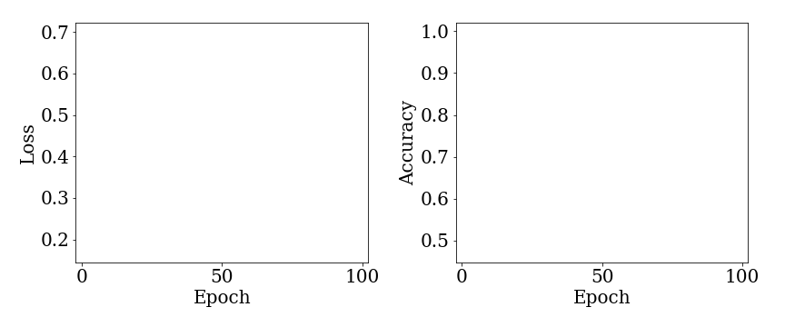

# One-Shot Learning for Modulation Format Identification in Evolving Optical Networks

## Presented at the postdeadline paper session at the 2019 OSA Advanced Photonics Congress, Photonics Networks and Devices, paper JW4A.2

### Authors: Carlos Natalino, Aleksejs Udalcovs, Lena Wosinska, Oskars Ozolins and Marija Furdek

**Abstract**: We report on the first successful application of one-shot machine learning scheme that identifies new modulation formats based on a single constellation diagram without re-training. 100% accuracy is achieved when expanding from 2 to 5 supported modulation formats.

## Training loss vs. accuracy

## What is in this repository?
We are making available the following:
* Implementation of the dataset importing and training the Siamese CNN ([link](./importing-training.ipynb))
* Implementation of the validation and testing of the training model ([link](./testing-plotting.ipynb))
* The dataset is available at:

## Setting up your environment (which libraries are required?)
You can setup you environment using Python 3.6 or Python 3.7.

The main libraries used are:
* ImageIO
* Scikit-Learn
* Keras
* Matplotlib
* NumPy

For the specific versions used in this repository, in the command line, at the folder containing this repository, you can run:

**If you are running Anaconda:**

`conda env create -f venv37-tf13-cpu.yml.yml` 

or 

`conda create --name <env_name> --file requirements.txt`.

**If you are running pip:**

`pip install --user --requirement requirements.txt`.

## Citing the work

Bibtex entry:

~~~~
@INPROCEEDINGS{NatalinoEtAl:2019:OSA-Networks, 
    author={Carlos Natalino and Aleksejs Udalcovs and Lena Wosinska and Oskarks Ozolins and Marija Furdek}, 
    booktitle = {Advanced Photonics Congress 2019 (Networks)},
    title={One-Shot Learning for Modulation Format Identification in Evolving Optical Networks}, 
    year={2019}, 
    pages={JW4A.2}
    }
~~~~

## References and tutorials useful during the development of this work:
* One Shot Learning with Siamese Networks using Keras (https://towardsdatascience.com/one-shot-learning-with-siamese-networks-using-keras-17f34e75bb3d)